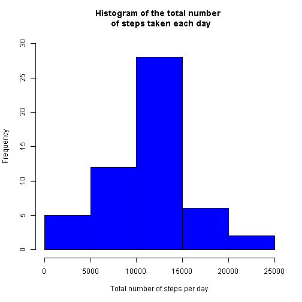
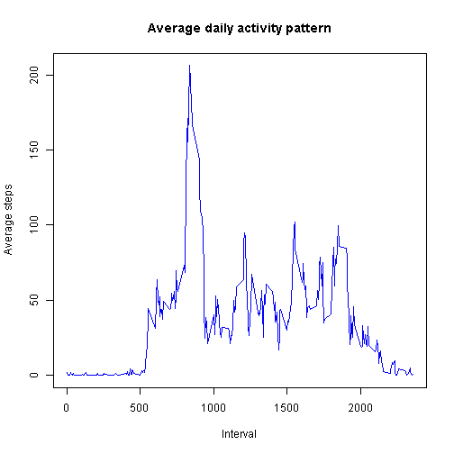
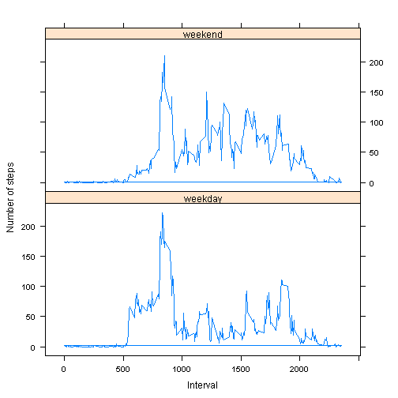

Reproducible Research: Peer Assessment 1                                                
========================================          
<br>


##Loading and preprocessing the data


```r
data <- read.csv(unz("activity.zip", "activity.csv"))
## remove observations in the raw data that contain NAs
processed_data <- data[complete.cases(data),]
## convert the type of processed_data$date from strings to dates 
processed_data$date <- as.Date(processed_data$date)
```

##What is mean total number of steps taken per day?

**1. Make a histogram of the total number of steps taken each day**


```r
# total_steps_per_day is an array with dates in character as attributes and 
# the total steps of each day as values.
total_steps_per_day <- tapply(processed_data$steps, processed_data$date, sum)
hist(total_steps_per_day, main = 'Histogram of the total number \n of steps taken each day', 
     xlab = 'Total number of steps per day', col = 'blue', ylim= c(0,30))
```

 


**2. Calculate and report the mean and median total number of steps taken per day**


```r
mean(total_steps_per_day)
```

```
## [1] 10766.19
```

```r
median(total_steps_per_day)
```

```
## [1] 10765
```
The mean is 10766.19 and median is 10765.

## What is the average daily activity pattern?


**1. Make a time series plot (i.e. type = "l") of the 5-minute interval (x-axis) 
and the average number of steps taken, averaged across all days (y-axis)**


```r
# average_steps_per_interval is an array with interval in character as attributes 
# and the average steps of each interval as values. names(average_steps_per_interval) 
# the attributes and as.integer(names(total_steps_per_day) converts the attibutes 
# returns in character to integer.
average_steps_per_interval <- tapply(processed_data$steps, processed_data$interval, mean)

plot(x= as.integer(names(average_steps_per_interval)),y = as.vector(average_steps_per_interval), 
     type = "l", main = 'Average daily activity pattern', xlab='Interval', 
     ylab = 'Average steps', col= 'blue' )
```

 
 


**2. Which 5-minute interval, on average across all the days in the dataset, contains 
   the maximum number of steps?**

```r
# which(average_steps_per_interval==max(average_steps_per_interval)) returns
# the index in array average_steps_per_interval where max value occurs
# and names(which(average_steps_per_interval==max(average_steps_per_interval)))
# returns the attribute name( interval in this case) at this index which correspons
# to the max value

# note (which(average_steps_per_interval==max(average_steps_per_interval)) returns ALL
# indices where the max value occurs. Alternatively, since as shown in the plot of 
# the previous sub question there's only one maximum, we can use 
# which.max(average_steps_per_interval), which returns only the FIRST index where 
# the maximum value occur, for simplicity.
names(which(average_steps_per_interval==max(average_steps_per_interval)))
```

```
## [1] "835"
```
The 5-minute interval 835, on average across all the days in the dataset, contains 
the maximum number of steps.
   
## Imputing missing values
 **1. Calculate and report the total number of missing values in the dataset (i.e. the total
    number of rows with NAs)**
    

```r
nrow(data) - sum(complete.cases(data))
```

```
## [1] 2304
```
The total number of missing values in the dataset (i.e. the total 
number of rows with NAs) is 2304.


**2. Devise a strategy for filling in all of the missing values in the dataset. The strategy 
   does not need to be sophisticated. For example, you could use the mean/median for that 
   day, or the mean for that 5-minute interval, etc.**


Let's try some exploratory data analysis first:


```r
sum(is.na(data$steps))
```

```
## [1] 2304
```

```r
sum(is.na(data$date))
```

```
## [1] 0
```

```r
sum(is.na(data$interval))
```

```
## [1] 0
```

The results above show that among the 3 variables/columns in data, only steps has NAs.

Next we look at mean daily steps:


```r
mean_daily_steps <- tapply(data$steps,data$date,mean, na.rm=TRUE)
sum(is.na(mean_daily_steps))
```

```
## [1] 8
```

so this means the values of steps are NAs on 8 days as revealed by the following:

```r
which(is.na(mean_daily_steps))
```

```
## 2012-10-01 2012-10-08 2012-11-01 2012-11-04 2012-11-09 2012-11-10 
##          1          8         32         35         40         41 
## 2012-11-14 2012-11-30 
##         45         61
```

To calculate mean steps per interval:

```r
mean_steps_over_interval = tapply(data$steps,data$interval,mean, na.rm=TRUE)
sum(is.na(mean_steps_over_interval))
```

```
## [1] 0
```

This means that for all intervals, there have been some meaningful values of steps
recorded and therfore, a valid mean steps for each interval exists. Since 
mean_daily_steps has NAs and mean_steps_over_interval doesn't, I decided to replace 
the NAs by the means for that interval.

 


**3. Create a new dataset that is equal to the original dataset but with the missing data filled in**

```r
newdata = transform(data, steps = ifelse(is.na(steps), mean_steps_over_interval, steps))
```

**4. Make a histogram of the total number of steps taken each day and Calculate and 
   report the mean and median total number of steps taken per day. Do these values 
   differ from the estimates from the first part of the assignment? What is the 
   impact of imputing missing data on the estimates of the total daily number of steps?**
   

```r
total_steps_per_day_newdata <- tapply(newdata$steps, newdata$date, sum)
hist(total_steps_per_day_newdata,xlab="Total number of steps taken each day",
     main="Histogram of daily number \n of steps  from imputed data", col = 'blue')
```

 

```r
mean(total_steps_per_day_newdata)
```

```
## [1] 10766.19
```

```r
median(total_steps_per_day_newdata)
```

```
## [1] 10766.19
```


**- Do these values differ from the estimates from the first part of the assignment?**

The means are the same while the medians are different. 
In the first part, mean = 10766.19 and median = 10765  whereas in this part, 
mean = 10766.19 and median = 10766.19

**- What is the impact of imputing missing data on the estimates of the total daily 
number of steps?**

After imputation, mean remains the same and median increases a little.


## Are there differences in activity patterns between weekdays and weekends? Use the dataset with the filled-in missing values for this part.

**1. Create a new factor variable in the dataset with two levels - "weekday" and 
   "weekend" indicating whether a given date is a weekday or weekend day.**

```r
newdata$date <- as.Date(newdata$date)
newdata$day <- weekdays(newdata$date)
newdata <- transform(newdata, day = ifelse(day %in% c("Friday","Saturday","Sunday"),
                                           "weekend", "weekday")) 
newdata$day <- as.factor(newdata$day)
```

**2. Make a panel plot containing a time series plot (i.e. type = "l") of the 5-minute
  interval (x-axis) and the average number of steps taken, averaged across all 
  weekday days or weekend days (y-axis). See the README file in the GitHub repository
  to see an example of what this plot should look like using simulated data.**


```r
average_steps_per_interval_weekday <- tapply(newdata[newdata$day=="weekday",]$steps, 
        newdata[newdata$day=="weekday",]$interval, mean)
average_steps_per_interval_weekend <- tapply(newdata[newdata$day=="weekend",]$steps, 
        newdata[newdata$day=="weekend",]$interval, mean)
#initialize a new column average_steps_per_interval for newdata
newdata$average_steps_per_interval <- 0.0
#average_steps_per_interval takes on different values depending on
#if it's weekday or weekend
newdata <-transform(newdata, average_steps_per_interval = ifelse(day=="weekend",
         average_steps_per_interval_weekend,average_steps_per_interval_weekday )) 

library(lattice)

xyplot(average_steps_per_interval~interval | day, data=newdata, type="l",
       main="", xlab="Interval",  ylab="Number of steps",layout=c(1,2))
```

 


From the panel plot, we can see there are slight differences in activity patterns between
weekdays and weekends.
